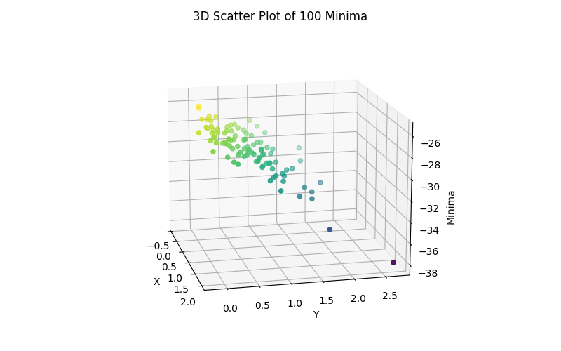
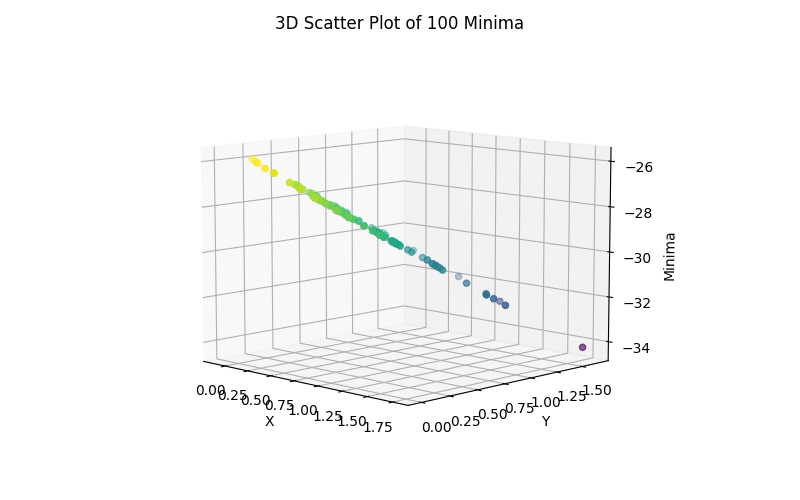
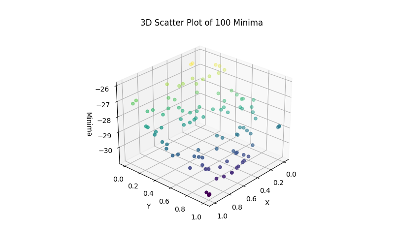
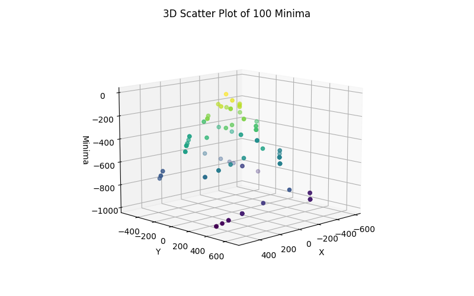

# Hill Climbing Algorithm for Eggholder Function

Since the random number is constrained to lie between 0 and 1, the output is limited within these boundaries.
The script can be run by the following command:
```bash
python3 eggholder.py
```
The program produces the following output:
```bash
Best minima found: x = 1.0, y = 1.0, value = -30.76141219919528
```

It is crucial to acknowledge that the global minima for the Eggholder function is located at x = 512 and y = 404.23, with a global minima value of -959.6407 (source: https://www.sfu.ca/~ssurjano/egg.html). Given that the random number boundaries range between 0 and 1, the minima discovered are also correspondingly bounded.
The objective is to minimize the value of z based on the Eggholder function. Without incorporating the step size, it can be observed that the Eggholder function only converges to the solution in the last few iterations.


## Without Step Size

<p align="center">
  
</p>


The 3D scatter plot showcasing the distribution of the minima found in each of the 100 runs provides valuable insight into the algorithm’s performance. It highlights the areas in the search where the algorithm tends to converge, offering a visual representation of the minima discovered during the search process.

## Plane Showing the Decline of Hill Climbing Algorithm

After introducing a maximum step size, the algorithm’s behavior changes. The maximum step size of 1.0 represents the distance between each neighbor of the current minima. With this modification, the scatter plot appears more dispersed, indicating that the hill climbing algorithm’s attempt to find the global minimum. 
<p align="center">
  
</p>
By adopting a maximum step size of 1.0, the search process is more controlled, preventing the algorithm from making overly large jumps in the search space. This constraint allows the algorithm to explore local neighbors of each point more thoroughly before moving onto the next position.
Additionally, terminating the optimization process when no improvement is observed in the last 100 steps ensures that the algorithm does not get stuck in an infinite loop, searching for a better solution that may not even exist. 

<p align="center">
  
</p>

## Exploring the Entire Eggholder Function Domain

In the updated implementation of the Hill Climbing algorithm, the search space has been expanded to cover the entire range of the Eggholder function, i.e., [-512, 512] for x and y coordinates. 

The modified code successfully demonstrated the ability of the Hill Climbing algorithm to approach the global minimum of the Eggholder function. In several instances, the algorithm comes close to finding the true global minimum, located at x = 512 and y = 404.23 with a value of -959.6407.
Output of the modified code:
```
Best minima found: x = 522.0425058157598, y = 413.1779373679, value = -976.9074732268316
```
The result shown in the Figure below, demonstrates the gradual decline of the Hill Climbing algorithm in finding a solution close to the global minimum of the Eggholder function. Although the discovered value is slightly lower than the known global minimum, the coordinates are in close proximity, showing the algorithm’s ability to explore the search space efficiently and converge near the optimal solution.

<p align="center">
  
</p>

In conclusion, the updated hill climbing algorithm demonstrates its effectiveness in finding the global minimum of the Eggholder function under the specified conditions. The algorithm effectively explores the search space and, in many cases, comes close to finding the true global minimum. This showcases the potential of the Hill Climbing Algorithm as a viable optimization algorithm for complex functions. 
